# LEVI Architecture

## Class Diagram

```mermaid
classDiagram
    Main --> DbConnection
    Main --> FileReaderUtil
    Main --> Conf
    Main --> CompareManager
    
    CompareManager --> Comparator
    CompareManager --> BatchExportService
    
    FileReaderUtil --> CsvProcessor
    CsvProcessor <|-- PropCsvProcessor
    CsvProcessor <|-- SiAdditionsCsvProcessor
    CsvProcessor <|-- SimpleOverview
    CsvProcessor <|-- TermspaceInactivationsCsvProcessor
    FileReaderUtil --> DescriptionAdditionLoader
    FileReaderUtil --> DescriptionInactivationLoader
    FileReaderUtil --> FhirJsonValueSetProcessor
    
    CsvProcessor --> ResultCollector
    Comparator --> ResultCollector
    RegexValidator --> ResultCollector
    BatchExportService --> ResultCollector
    FileWriterUtil --> ResultCollector

    class Main {
        + main(String[] args) void
    }
    
    class Conf {
        + getFilePathCurrent() String
        + getDestination() String
    }

    class DbConnection {
        + connect() void
        + disconnect() void
    }

    class FileReaderUtil {
        - file : File
        - encoding : String
        + readFile(String path) List&lt;List&lt;String&gt;&gt;
    }

    class FileWriterUtil {
        + writeToFile(String filePath, List&lt;List&lt;String&gt;&gt; data) void
    }

    class CsvProcessor {
        &lt;&lt;abstract&gt;&gt;
        # csvReader : CSVReader
        + process() void
    }

    class PropCsvProcessor {
        + process() void
    }

    class SiAdditionsCsvProcessor {
        - collector : ResultCollector
        + process() void
    }

    class SimpleOverview {
        - collector : ResultCollector
        + process() void
    }

    class TermspaceInactivationsCsvProcessor {
        - collector : ResultCollector
        + process() void
    }

    class DescriptionAdditionLoader {
        + load(String path) void
    }

    class DescriptionInactivationLoader {
        + load(String path) void
    }

    class FhirJsonValueSetProcessor {
        + processJson(String path) void
    }

    class Comparator {
        + compareTranslations() void
    }

    class CompareManager {
        + runTranslationOverview() void
        + runGenerateDelta() void
    }

    class BatchExportService {
        + assignGroups() void
        + splitBatches() void
        + writeFiles() void
    }

    class RegexValidator {
        + validateTerm(String term) boolean
    }

    class ResultCollector {
        - newTranslations : List&lt;List&lt;String&gt;&gt;
        - inactivations : List&lt;List&lt;String&gt;&gt;
        - synonyms : List&lt;List&lt;String&gt;&gt;
        + setFullNewTranslationCurrent(...)
        + setFullInactivationsCurrent(...)
        + getNewTranslations() List&lt;List&lt;String&gt;&gt;
        + getInactivations() List&lt;List&lt;String&gt;&gt;
        + getSynonyms() List&lt;List&lt;String&gt;&gt;
    }

    class ChangeType {
        &lt;&lt;enumeration&gt;&gt;
        CHANGE
        ADDITION
        INACTIVATION
        REACTIVATION
    }
```

## Core Components (levi-core)

* `Main.java`: Entry point for CLI execution. Handles argument parsing and task routing.
* `DbConnection.java`: Manages JDBC connections to MySQL database.
* `FileReaderUtil.java`: Determines file type and delegates reading to appropriate processors.
* `Comparator.java`: Compares translations between files.
* `CompareManager.java`: Orchestrates comparison workflows.
* `RegexValidator.java`: Performs automated validation of terms based on language-specific rules.
* `ResultCollector.java`: Central storage for processed entries with filtering capabilities.
* `FileWriterUtil.java`: Writes results to output files in UTF-8 encoding.
* CSV/Excel Processors: Format-specific processing for various input types.

## GUI Components (levi-gui)

* `LeviGuiApplication.java`: JavaFX application entry point.
* Controllers: Handle user interactions and UI updates.
* Services: Business logic layer interfacing with levi-core.
* Models: Data models for configuration and job execution.
* FXML Layouts: UI component definitions.
* CSS Styling: Visual styling for the application.
* i18n Resources: Multi-language support (German, English, French, Italian).
