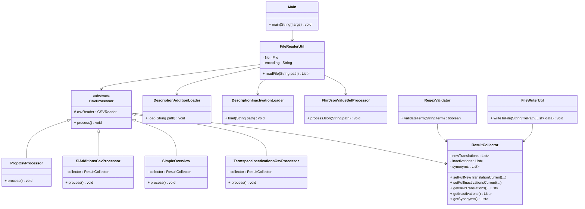

# LEVI for SNOMED

**LEVI for SNOMED** – Language and Extension Validation & Import for SNOMED

## Description

LEVI for SNOMED is a utility tool that acts as a bridge between the SNOMED International Authoring Tool and TermMed's Termspace. It facilitates the validation, comparison, and import of translation content into SNOMED CT extensions for German, French, and Italian. The tool supports multiple input formats including CSV, TSV, Excel, and FHIR JSON, and ensures consistency and accuracy in translation submissions.

## Features

- Validation of translation terms before import
- Comparison with existing SNOMED extensions
- Import template generation for new or updated translations
- Detection and preparation of inactivation entries
- Regex-based language checks for quotes, soft hyphens, spaces around slashes, and capitalization
- Support for CSV, TSV, Excel, and FHIR JSON files
- Handling of both "current" and "previous" releases
- User prompts for missing language codes in certain files

## Getting Started / Installation

### Prerequisites

- Java 17 or later
- Maven
- A database such as **MySQL** (the code uses SQL queries for lookups)

The database can be set up and populated with the SNOMED International Edition and a National Extension using the companion project:  
👉 [SNOMED_Database](https://github.com/eHealth-Suisse/SNOMED_Database)  

The SNOMED International Edition and National Extensions can be obtained via [**MLDS from SNOMED International**](https://mlds.ihtsdotools.org/), once a license has been granted.


### Installation Steps

```bash
git clone https://github.com/your-org/SNOMED_Applications.git
```

## Option A: Run via Eclipse (no command line arguments)

1. Open Eclipse IDE
2. Select **File > Import > Existing Projects into Workspace**
3. Choose the cloned `LEVI-for-SNOMED` folder
4. Open `Conf.java` and set the file paths and parameters directly in the class
5. In `Main.java`, make sure the desired method is **uncommented**, for example:

```java
compareManager.runTranslationOverview(conf.getFilePathCurrent(), conf.getDestination());
```

6. Right-click `Main.java` → **Run As** → **Java Application**


## Option B: Build JAR and run via Command Line

### Step 1: Build the JAR with Maven

Open a terminal in the project root folder (where `pom.xml` is located) and run:

```bash
mvn clean package
```

This creates the following file in the `target/` folder:

```
target/SNOMEDTranslationCheck-0.0.1-SNAPSHOT-jar-with-dependencies.jar
```

### Step 2: Run the JAR with arguments

Open a terminal and navigate to the `target/` folder:

```bash
cd C:\Users\eHealth Suisse\Documents\GitHub\LEVI-for-SNOMED\LEVI\target
```

Then run the JAR with the desired task and parameters. Example for the **Translation Overview**:

```bash
java -jar SNOMEDTranslationCheck-0.0.1-SNAPSHOT-jar-with-dependencies.jar ^
  --task=overview ^
  --country=DE ^
  --current="C:\Users\eHealth Suisse\Desktop\SNOMED\Files zum Pruefen\Q_ICD-10-SNOMED_x8.xlsx" ^
  --dest="C:\Users\eHealth Suisse\Desktop\SNOMED"
```

### Available tasks

| Argument            | Description                              |
|---------------------|------------------------------------------|
| `--task=overview`        | Translation Overview                |
| `--task=desc-add`        | Delta Description Additions         |
| `--task=desc-inact`      | Delta Description Inactivations     |
| `--task=translate-delta` | Generate Translation Delta          |
| `--task=eszett-check`    | Check Eszett in Extension           |
| `--task=not-published`   | Delta Not Published Translations    |

### All available arguments

| Argument              | Description                              |
|-----------------------|------------------------------------------|
| `--task=`             | Task to execute (see table above)        |
| `--country=`          | Country code (e.g. DE, FR, IT)           |
| `--current=`          | Path to the current input file           |
| `--previous=`         | Path to the previous input file          |
| `--dest=`             | Output destination folder                |
| `--dbUrl=`            | JDBC database URL                        |
| `--dbUser=`           | Database username                        |
| `--dbPassword=`       | Database password                        |
| `--transformEszett=`  | true/false – transform Eszett (ß)        |
| `--regex=`            | true/false – enable regex validation     |

> ⚠️ **Note:** To use command line arguments, the argument parsing block in `Main.java` must be **uncommented**.

---

## Architecture / Technical Overview

LEVI consists of several modular components:

* `Main.java`: Entry point of the application. Triggers workflows such as delta generation, additions, inactivations, or translation overview.
* `FileReaderUtil.java`: Determines file type and delegates reading to appropriate processors. Supports CSV, TSV, Excel, and JSON files.
* `DescriptionAdditionLoader.java` / `DescriptionInactivationLoader.java`: Process Excel sheets for additions and inactivations.
* `PropCsvProcessor.java`, `SiAdditionsCsvProcessor.java`, `SimpleOverview.java`, `TermspaceInactivationsCsvProcessor.java`: Process specific CSV/TSV formats from Termspace or PropCSV.
* `FhirJsonValueSetProcessor.java`: Reads FHIR ValueSet JSON files and extracts translation entries.
* `RegexValidator.java`: Performs automated validation of terms based on language-specific and general rules.
* `ResultCollector.java`: Central storage for all processed entries. Supports multiple types of entries and provides filtering and retrieval methods.
* `FileWriterUtil.java`: Writes processed results to output files in UTF-8 encoding.

The system ensures that all translation entries are validated and collected for further analysis, delta generation, or import.

## Class Diagram

```mermaid
classDiagram
    Main --> FileReaderUtil
    FileReaderUtil --> CsvProcessor
    CsvProcessor <|-- PropCsvProcessor
    CsvProcessor <|-- SiAdditionsCsvProcessor
    CsvProcessor <|-- SimpleOverview
    CsvProcessor <|-- TermspaceInactivationsCsvProcessor
    FileReaderUtil --> DescriptionAdditionLoader
    FileReaderUtil --> DescriptionInactivationLoader
    FileReaderUtil --> FhirJsonValueSetProcessor
    CsvProcessor --> ResultCollector
    RegexValidator --> ResultCollector
    FileWriterUtil --> ResultCollector

    class Main {
        + main(String[] args) void
    }

    class FileReaderUtil {
        - file : File
        - encoding : String
        + readFile(String path) List<List<String>>
    }

    class FileWriterUtil {
        + writeToFile(String filePath, List<List<String>> data) void
    }

    class CsvProcessor {
        <<abstract>>
        # csvReader : CSVReader
        + process() void
    }

    class PropCsvProcessor {
        + process() void
    }

    class SiAdditionsCsvProcessor {
        - collector : ResultCollector
        + process() void
    }

    class SimpleOverview {
        - collector : ResultCollector
        + process() void
    }

    class TermspaceInactivationsCsvProcessor {
        - collector : ResultCollector
        + process() void
    }

    class DescriptionAdditionLoader {
        + load(String path) void
    }

    class DescriptionInactivationLoader {
        + load(String path) void
    }

    class FhirJsonValueSetProcessor {
        + processJson(String path) void
    }

    class RegexValidator {
        + validateTerm(String term) boolean
    }

    class ResultCollector {
        - newTranslations : List<List<String>>
        - inactivations : List<List<String>>
        - synonyms : List<List<String>>
        + setFullNewTranslationCurrent(...)
        + setFullInactivationsCurrent(...)
        + getNewTranslations() List<List<String>>
        + getInactivations() List<List<String>>
        + getSynonyms() List<List<String>>
    }
```

## Workflow

1. `Main` triggers a processing workflow.
2. `FileReaderUtil` reads input files and passes them to the correct processor.
3. Processor classes parse data rows and populate the `ResultCollector`.
4. Optional validation is performed using `RegexValidator`.
5. Results can be written to output files with `FileWriterUtil`.

## Configuration

* Database connection
* Country code (will set the Language Code)
* Input/output paths
* Check for Eszett (ß)


## Folder / File Structure

```bash
/src
  /main
    /java
      translation/check
        Main.java
        FileReaderUtil.java
        FileWriterUtil.java
        DescriptionAdditionLoader.java
        DescriptionInactivationLoader.java
        PropCsvProcessor.java
        SiAdditionsCsvProcessor.java
        SimpleOverview.java
        TermspaceInactivationsCsvProcessor.java
        FhirJsonValueSetProcessor.java
        RegexValidator.java
        ResultCollector.java
        Conf.java
```

## Dependencies

* **Apache Commons Lang 3**

  * For utilities like `Pair`
* **OpenCSV**

  * `CSVReader`, `CSVParserBuilder`, `CSVReaderBuilder`
* **Apache POI**

  * For Excel file support (`HSSFWorkbook`, `XSSFWorkbook`, `Sheet`, etc.)
* **JDBC (java.sql.\*)**

  * For database interaction
* **Java Core Libraries**

  * `java.io`, `java.nio.file`, `java.util`, `java.util.stream`, etc.

## Contributing

Contributions are welcome. Please fork the repository and submit a pull request. For new features, discuss via an issue first.

## Desktop GUI

A modern JavaFX-based desktop GUI is now available in the `LEVI-GUI` directory! The GUI provides:

- **Intuitive Interface**: Easy-to-use graphical interface for all LEVI operations
- **Configuration Management**: Visual editor for database settings, file paths, and options
- **Job Execution**: Run all 6 workflows with progress tracking
- **Results Display**: View statistics and export results
- **Multi-language Support**: German, English, French, and Italian
- **Secure Configuration**: AES-256 encrypted password storage

**Quick Start:**
```bash
cd LEVI-GUI
mvn clean package
```

Then **double-click** the launcher for your OS:
- Windows: `launch-levi-gui.bat`
- Linux: `launch-levi-gui.sh`
- macOS: `launch-levi-gui.command`

Or run directly: `java -jar target/levi-gui-1.0.0.jar`

For more details, see [LEVI-GUI/INSTALLATION.md](LEVI-GUI/INSTALLATION.md) and [LEVI-GUI/README-GUI.md](LEVI-GUI/README-GUI.md)

## Group-Based Aligned Batch Export (`translate-delta`)

When running the `translate-delta` task (`CompareManager.runGenerateDelta`), LEVI now writes output files grouped by the combination of change types that apply to each concept, instead of four independent flat files.

### How it works

1. **Concept matrix** – After all delta data is generated, every concept ID is mapped to the set of change types that apply to it (`CHANGE`, `ADDITION`, `INACTIVATION`, `REACTIVATION`).
2. **Group assignment** – Each concept is placed in exactly one of 15 groups (G1–G15) based on its unique combination:

   | Group | Change types |
   |-------|-------------|
   | G1 | CHANGE |
   | G2 | ADDITION |
   | G3 | INACTIVATION |
   | G4 | REACTIVATION |
   | G5 | CHANGE + ADDITION |
   | G6 | CHANGE + INACTIVATION |
   | G7 | CHANGE + REACTIVATION |
   | G8 | ADDITION + INACTIVATION |
   | G9 | ADDITION + REACTIVATION |
   | G10 | INACTIVATION + REACTIVATION |
   | G11 | CHANGE + ADDITION + INACTIVATION |
   | G12 | CHANGE + ADDITION + REACTIVATION |
   | G13 | CHANGE + INACTIVATION + REACTIVATION |
   | G14 | ADDITION + INACTIVATION + REACTIVATION |
   | G15 | CHANGE + ADDITION + INACTIVATION + REACTIVATION |

3. **Aligned batch splitting** – If a group contains more than `batchSize` concepts (default: **1 000**, configurable via the `BatchExportService` constructor), the concept list is split into chunks. All files in the same group and batch always contain the **identical** set of concept IDs.

### Output file naming

| Scenario | Example file names |
|----------|--------------------|
| No split needed | `G5_changes.tsv`, `G5_additions.tsv` |
| Split needed | `G5_changes_batch1.tsv`, `G5_additions_batch1.tsv`, `G5_changes_batch2.tsv`, … |

Only change types that are actually present in a group produce a file (e.g. G5 produces no inactivation file).

### New / modified classes

| Class | Role |
|-------|------|
| `ChangeType` | Enum: `CHANGE`, `ADDITION`, `INACTIVATION`, `REACTIVATION` |
| `BatchExportService` | Builds the concept matrix, assigns groups, splits batches, writes files |
| `ResultCollector` | Extended with a description-ID → concept-ID map used to resolve concept IDs for change and reactivation rows |
| `Comparator` | Populates the description → concept mapping when change/reactivation entries are created |
| `CompareManager` | `runGenerateDelta` now delegates all file writing to `BatchExportService` |

---

## Known Issues / Limitations

* No multithreading for large files
* Tested against a specific TermMed SNOMED extension setup
* Language code must be manually entered for some files if missing

## License

This project is licensed under the MIT License.
