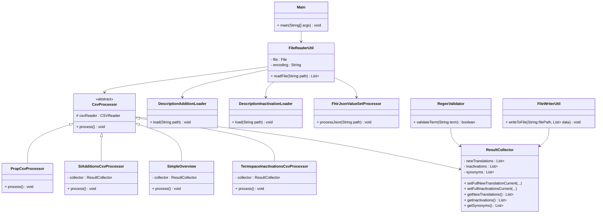

# LEVI for SNOMED

**LEVI for SNOMED** – Language and Extension Validation & Import for SNOMED

## Description

LEVI for SNOMED is a utility tool that acts as a bridge between the SNOMED International Authoring Tool and TermMed's Termspace. It facilitates the validation, comparison, and import of translation content into SNOMED CT extensions for German, French, and Italian. The tool supports multiple input formats including CSV, TSV, Excel, and FHIR JSON, and ensures consistency and accuracy in translation submissions.

## Features

- Validation of translation terms before import
- Comparison with existing SNOMED extensions
- Import template generation for new or updated translations
- Detection and preparation of inactivation entries
- Regex-based language checks for quotes, soft hyphens, spaces around slashes, and capitalization
- Support for CSV, TSV, Excel, and FHIR JSON files
- Handling of both "current" and "previous" releases
- User prompts for missing language codes in certain files

## Getting Started / Installation

### Prerequisites

- Java 17 or later
- Maven
- A database such as **MySQL** (the code uses SQL queries for lookups)

The database can be set up and populated with the SNOMED International Edition and a National Extension using the companion project:  
👉 [SNOMED_Database](https://github.com/eHealth-Suisse/SNOMED_Database)  

The SNOMED International Edition and National Extensions can be obtained via [**MLDS from SNOMED International**](https://mlds.ihtsdotools.org/), once a license has been granted.


### Installation Steps

```bash
git clone https://github.com/your-org/SNOMED_Applications.git
```

* Open Eclipse IDE
* Select "Import > Existing Projects into Workspace"
* Choose the cloned levi-for-snomed folder
* Run `Main.java` as a Java application

## Architecture / Technical Overview

LEVI consists of several modular components:

* `Main.java`: Entry point of the application. Triggers workflows such as delta generation, additions, inactivations, or translation overview.
* `FileReaderUtil.java`: Determines file type and delegates reading to appropriate processors. Supports CSV, TSV, Excel, and JSON files.
* `DescriptionAdditionLoader.java` / `DescriptionInactivationLoader.java`: Process Excel sheets for additions and inactivations.
* `PropCsvProcessor.java`, `SiAdditionsCsvProcessor.java`, `SimpleOverview.java`, `TermspaceInactivationsCsvProcessor.java`: Process specific CSV/TSV formats from Termspace or PropCSV.
* `FhirJsonValueSetProcessor.java`: Reads FHIR ValueSet JSON files and extracts translation entries.
* `RegexValidator.java`: Performs automated validation of terms based on language-specific and general rules.
* `ResultCollector.java`: Central storage for all processed entries. Supports multiple types of entries and provides filtering and retrieval methods.
* `FileWriterUtil.java`: Writes processed results to output files in UTF-8 encoding.

The system ensures that all translation entries are validated and collected for further analysis, delta generation, or import.

## Class Diagram


## Workflow

1. `Main` triggers a processing workflow.
2. `FileReaderUtil` reads input files and passes them to the correct processor.
3. Processor classes parse data rows and populate the `ResultCollector`.
4. Optional validation is performed using `RegexValidator`.
5. Results can be written to output files with `FileWriterUtil`.

## Configuration

* Database connection
* Country code (will set the Language Code)
* Input/output paths
* Check for Eszett (ß)


## Folder / File Structure

```bash
/src
  /main
    /java
      translation/check
        Main.java
        FileReaderUtil.java
        FileWriterUtil.java
        DescriptionAdditionLoader.java
        DescriptionInactivationLoader.java
        PropCsvProcessor.java
        SiAdditionsCsvProcessor.java
        SimpleOverview.java
        TermspaceInactivationsCsvProcessor.java
        FhirJsonValueSetProcessor.java
        RegexValidator.java
        ResultCollector.java
        Conf.java
```

## Dependencies

* **Apache Commons Lang 3**

  * For utilities like `Pair`
* **OpenCSV**

  * `CSVReader`, `CSVParserBuilder`, `CSVReaderBuilder`
* **Apache POI**

  * For Excel file support (`HSSFWorkbook`, `XSSFWorkbook`, `Sheet`, etc.)
* **JDBC (java.sql.\*)**

  * For database interaction
* **Java Core Libraries**

  * `java.io`, `java.nio.file`, `java.util`, `java.util.stream`, etc.

## Contributing

Contributions are welcome. Please fork the repository and submit a pull request. For new features, discuss via an issue first.

## Desktop GUI

A modern JavaFX-based desktop GUI is now available in the `LEVI-GUI` directory! The GUI provides:

- **Intuitive Interface**: Easy-to-use graphical interface for all LEVI operations
- **Configuration Management**: Visual editor for database settings, file paths, and options
- **Job Execution**: Run all 6 workflows with progress tracking
- **Results Display**: View statistics and export results
- **Multi-language Support**: German, English, French, and Italian
- **Secure Configuration**: AES-256 encrypted password storage

**Quick Start:**
```bash
cd LEVI-GUI
mvn clean package
java -jar target/levi-gui-1.0.0.jar
```

For more details, see [LEVI-GUI/README-GUI.md](LEVI-GUI/README-GUI.md)

## Known Issues / Limitations

* No multithreading for large files
* Tested against a specific TermMed SNOMED extension setup
* Language code must be manually entered for some files if missing

## License

This project is licensed under the MIT License.
